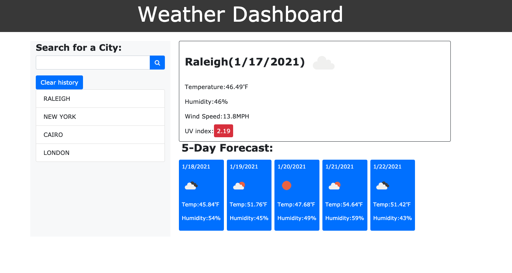

# weather-Dashboard API

## Description

This is a web application that will produce the current weather and 5 day forecast for any city. The information is pulled from an API (OpenWeather API). It was created using aJax call and jquery. All previous searches are added to history and will populate again once clicked.

## Tech/framework used
HTML, CSS, Bootstrap, jQuery and moment.js library 

## Authors
Tarek Behairy

## Screenshots


## Deployed application link
https://tarekbe55.github.io/weather-dash/


# Contact
Reach me at tbtarek@gmail.com for any questions

# Project description below

# 06 Server-Side APIs: Weather Dashboard

Developers are often tasked with retrieving data from another application's API and using it in the context of their own. Third-party APIs allow developers to access their data and functionality by making requests with specific parameters to a URL. Your challenge is to build a weather dashboard that will run in the browser and feature dynamically updated HTML and CSS.

Use the [OpenWeather API](https://openweathermap.org/api) to retrieve weather data for cities. The documentation includes a section called "How to start" that will provide basic setup and usage instructions. Use `localStorage` to store any persistent data.

## User Story

```
AS A traveler
I WANT to see the weather outlook for multiple cities
SO THAT I can plan a trip accordingly
```

## Acceptance Criteria

```
GIVEN a weather dashboard with form inputs
WHEN I search for a city
THEN I am presented with current and future conditions for that city and that city is added to the search history
WHEN I view current weather conditions for that city
THEN I am presented with the city name, the date, an icon representation of weather conditions, the temperature, the humidity, the wind speed, and the UV index
WHEN I view the UV index
THEN I am presented with a color that indicates whether the conditions are favorable, moderate, or severe
WHEN I view future weather conditions for that city
THEN I am presented with a 5-day forecast that displays the date, an icon representation of weather conditions, the temperature, and the humidity
WHEN I click on a city in the search history
THEN I am again presented with current and future conditions for that city
WHEN I open the weather dashboard
THEN I am presented with the last searched city forecast
```

The following image demonstrates the application functionality:


## Review

You are required to submit the following for review:

* The URL of the deployed application.

* The URL of the GitHub repository. Give the repository a unique name and include a README describing the project.

- - -
© 2021 Trilogy Education Services, LLC, a 2U, Inc. brand. Confidential and Proprietary. All Rights Reserved.
